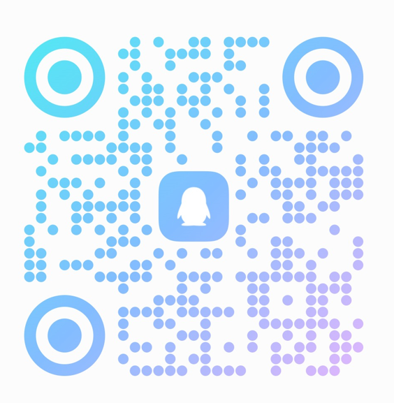

<h1>Mirra</h1>

简体中文 | [English](README.md)

**Windows 也能直接操作 iPhone。** 免费、无需账号的 iPhone 镜像控制工具——不只投屏，还能用鼠标、键盘直接操作手机。

https://github.com/user-attachments/assets/ab38bbb8-6147-4619-b7e5-6e7c557f95c2

免费 · 非开源 · 无账号 · iPhone 零安装 · 无需越狱 · 数据本地直连

Windows / macOS · Wi-Fi / USB · iOS 27+

## 下载

前往 [GitHub Releases](https://github.com/nodnix/mirra/releases)，根据发布说明下载对应版本。Windows 版为绿色便携版，解压后直接运行，无需安装。

> **Windows 首次运行提示**：Mirra 是免费的非开源软件，未使用代码签名证书，因此首次双击运行时，Windows 可能弹出「Windows 已保护你的电脑」（SmartScreen）。点击 **「更多信息」→「仍要运行」** 即可正常使用——这是未签名应用的正常提示，不代表软件有问题。

## 快速开始

**开始前确认：**

- iPhone 需要运行 iOS 27 或更新版本，且需要打开开发者模式（软件内有指引）。
- 电脑需为 Windows 10/11（64 位 x64），或 macOS 14 及以上、搭载 Apple 芯片（Apple Silicon）的 Mac。
- Wi-Fi 连接时，电脑与 iPhone 位于同一局域网；USB 连接请使用支持数据传输的线缆。
- 首次准备连接组件需要访问互联网。

连接流程：下载并打开 Mirra → 选择 Wi-Fi → 开启开发者模式 → 完成配对 → 等待首次准备 → 出现可操作的 iPhone 画面。使用 USB 时，选择“USB”并按界面提示连接数据线、完成信任。

https://github.com/user-attachments/assets/e572b948-ee1e-428f-8eb4-faae2ccc1e82

## 常见问题

### 为什么在隐私与安全中找不到开发者模式？

需要让手机和电脑处于同一局域网，然后在 Mirra 中依次选择“连接新手机 → Wi-Fi 无线 → 尚未开启/不确定 → 开始设置”。Mirra 会在局域网内广播，之后可在手机上找到开发者模式入口。

也可以借助 Xcode 或爱思助手等工具开启开发者模式。

### 可以在外面通过互联网控制家里的手机吗？

当前支持同一局域网 Wi-Fi 和 USB 连接，不提供跨互联网远程控制。

### 为什么画面还在更新，手机却没有响应？

由于 iPhone 的安全限制，部分系统授权弹窗不出现在镜像画面里。请查看实体 iPhone，处理手机上的提示后再继续。

### 为什么找不到手机？

Wi-Fi 连接请检查两端是否位于同一局域网，USB 连接请检查线缆和信任状态。

### 为什么公司的 Wi-Fi 网络不行？

可能是公司网络限制了 mDNS 这类协议，请改用 USB 连接。

### 连接组件准备失败怎么办？

检查网络后重试，并在反馈时附上界面显示的错误代号。

### Windows 弹出「Windows 已保护你的电脑」怎么办？

这是未签名软件的正常提示——签名证书需要付费，Mirra 免费、暂未购买。点击「更多信息」→「仍要运行」即可。

## 反馈与更新

遇到问题，或有希望增加的功能，欢迎告诉我，描述你的使用场景。

**反馈入口：** [GitHub Issues](https://github.com/nodnix/mirra/issues)。

提交问题时，尽量附上 Mirra 版本、电脑系统、手机型号和 iOS 版本、连接方式，以及复现步骤。不要在公开 Issue 中上传密码、验证码、配对凭据或含有私人内容的原始日志。

欢迎加入 **Mirra 交流群**（QQ 群号 `1126919301`），直接在这里反馈问题与需求。

## 隐私与许可

镜像与控制通过电脑和手机之间的局域网或 USB 连接进行，不经过 Mirra 的云端视频中转。连接组件准备、启动统计和用户主动提交的问题反馈可能访问互联网。

[隐私说明](PRIVACY.zh-CN.md) · [使用条款](TERMS.zh-CN.md) · [第三方软件声明](THIRD_PARTY_NOTICES.zh-CN.md) · [开源软件权利](OPEN_SOURCE_RIGHTS.zh-CN.md) · [安全问题报告](SECURITY.zh-CN.md)

Mirra 自身暂不开源；随产品分发的第三方开源组件仍遵循各自的许可证。第三方组件源码不等于 Mirra 产品源码。
